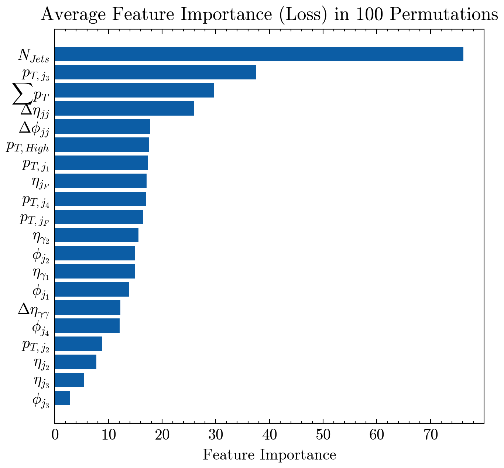

# Quantum Computing Meets Higgs Boson
Summary of models and work done during my Seniour Honour's Project at the University of Edinburgh. During the project we aim to classify di-photon events as signal 
(events coming from a Higgs Boson) or background (those coming from other sources). We will do this via Dense Neural Networks (DNN) and later with Variational Quantum Classifiers (VQC) and compare them. For more detail, the Project Report is included in the repository.

## Monte-Carlo Dataset
In this project, we utilize data with di-photon events from the signal $H \rightarrow \gamma \gamma$ events
and background events with no Higgs boson. The signal processes were generated using
Powheg Box v2 and interfaced with Pythia 8.2. Background simulated
samples were generated using MadGraph5 aMC@NLO and interfaced with Pythia
8.2. ATLAS detector response for both signal and background events was simulated using
Geant4. The simulated data was produced by the ATLAS experiment and provided
by the project supervisor Dr. Liza Mijovic. 

## Feature Engineering
Data contains the transverse momenta $p_T$, energy $E$, pseudorapidity $\eta$, azimuthal angle $\phi$ of the 2 leading photons and 4 leading particle jets; and the total number of jets for a given event.
Using these features, we engineered new ones based on [arXiv:2207.00348 [hep-ex]](https://arxiv.org/abs/2207.00348). All the features used can be found in the project report.
To manipulate the data and make new features, we utilized heavily numpy arrays and pylorentz Momentum4 objects to represent each particle. 
The code used to engineer the features can be found in engineer.py.

## Dense Neural Network
We first trained a dense fully connected neural network to act as a benchmark model. The model was trained using the ADAM optimizer with a learning rate of 0.001 and a
batch size of 1000. To avoid over-fitting and to reduce the training times, we used an
earlystopping callback function that monitors the validation accuracy and stops training
once performance stops improving. 
After applying min-max scaling on the 41 engineered features, we split the dataset
into 80% training, 10% validation and 10% testing. We then used this to train the
fully connected neural network, with an excellent testing accuracy of 95%. Below we show the accuracy and loss plots during training.

 

Validation accuracy and loss is very close to the training one, which suggests little to no overfitting.

## Permutation Ranking
In preparation for the quantum classifiers, we ranked the features based on importance.
The goal here is to be able to reduce the number of features while retaining as much
information as possible. To do this we used the permutation feature ranking algorithm
based on [	arXiv:1801.01489 [stat.ME]](https://arxiv.org/abs/1801.01489). It goes as follows:
Input: Trained model, testing data $X$ and true outcome $Y$.
1. Calculate $L_{orig}$, the loss of the model based on the predictions on the testing data. In our case the binary cross-entropy.
2. For each feature $f$:
  - Generate a new training data set by permuting or shuffling feature $f$ in $X$. This breaks any association between feature $f$ and the true outcome $Y$
  - Calculate $L_{perm}$, the loss of the model based on the predictions on the permuted data
  - Calculate permutation feature importance as the quotient $FI_{f} = \frac {L_{orig}}{L_{perm}}$
3. Sort features by descending $FI$.

The resulting ranking is shown below for the top 20 features.

Using these we trained 2 more neural networks using the top 20 and top 6 features respectively. These 2 models have an accuracy of 94% and 86% respectively, suggesting that the permutation ranking is accurate as most of the information is captured in a few features. 
Below we show a comparison of all 3 models.

